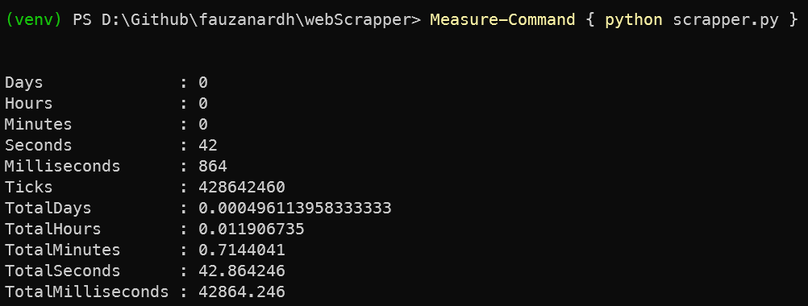
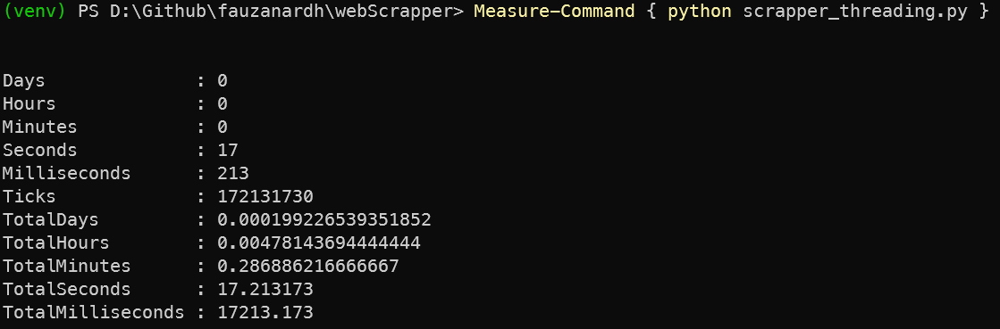

# Simple Web Scrapper
This project is as a part of BINUS International Computer Architecture and Operating System final project.

## This project uses
1. Socket for making a http request
2. Threading for "parallelizing" the http request, tho it's not really a parallelism because we're only using Thread
3. http.client HTTPResponse for parsing the http response 
4. BeautifulSoup4+lxml for parsing the http content

## How to run this project
1. install the dependencies
```
pip install -r requirements.txt
or
pip install beautifulsoup4 lxml
```
2. run either the `scapper.py` or the `scrapper_threading.py`
```
python scrapper.py
or
python scrapper_threading.py
```

## Performance difference
On my 50Mbps connection and 6 cores machine:
1. non-threading
    
1. threading
    