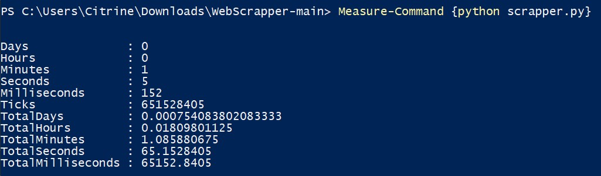
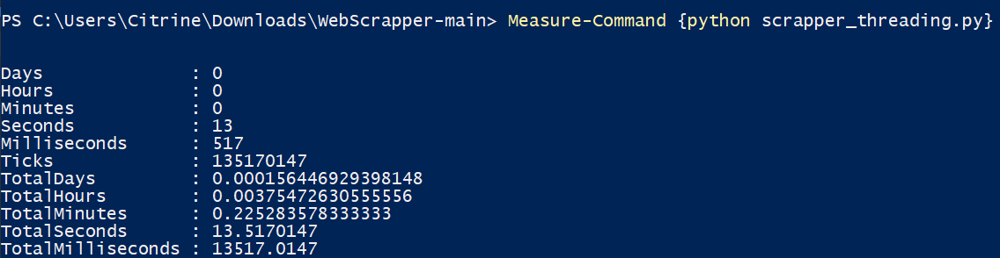

# What is a Web Scraper
A Web Scraper is an application used for harvesting data from sites through the use of HTTP, storing the data found on a local file or database.

# Simple Web Scrapper
A repository for our final project for Computer Architecture and Operating Systems class in Binus International.

## Details
We have 2 main files, `scrapper` and `scrapper_threading`

`scrapper_threading` uses `threadpool` in order to create threads to make the process go faster than `scrapper` which doesn't use any threading. The number of threads used is determined by the number of cores the current CPU has, with a maximum of 32 cores being created at any given time. 

For example:
If a CPU has a single core, then we will make 5 threads, if a CPU has more than or equal to 32 cores, we will only make 32 threads in order to avoid using too many resources on the higher core machines.

## Team Members:
- Fauzan
- Stanlly

## This project uses
1. Socket for making a http request
2. Threading for "parallelizing" the http request, tho it's not really a parallelism because we're only using Thread
3. http.client HTTPResponse for parsing the http response 
4. BeautifulSoup4+lxml for parsing the http content

## How to Run the Project
1. Install the dependencies. When `requirements.txt` make sure the CMD/Shell is in the folder that contains the file.
```
pip install -r requirements.txt
or
pip install beautifulsoup4 lxml
```
2. Run either `scapper.py` or `scrapper_threading.py`
```
python scrapper.py
or
python scrapper_threading.py
```

## Comparing Non-Threaded vs Threaded
On Fauzan's 50Mbps connection and 6 Core Machine:
1. Non-Threaded:
    
2. Threaded:
    

On Stanlly's 60Mbps connection and 8 Core Machine:
1. Non-Threaded:
    
2. Threaded:
    
